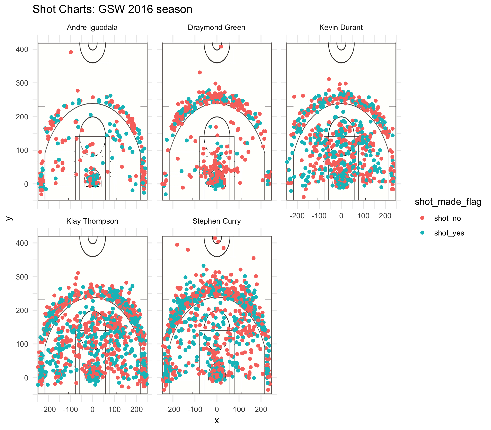

Workout 1
================
Andrew Chen

Data-based analysis of the five best GSW players!!
==================================================

------------------------------------------------------------------------


> Take Home Message: If you do not have the time to read this article, just remember that the strength of the GSW stems from their diverse collection of skills. And that for the next season, Draymond Green should pass the ball more.

*Intro* The Golden State warriors have been so dominant. But why? They have good players, they are lucky, they are good at teamwork... these are all hypotheses and for a statistician, we need to test these hypotheses using data! In this report I will analyze some nba data from the 2016 season, and analyze quantitatively what makes the golden state warriors so special. In the process I will practice my data cleaning, data analysis, and the more meta data skills like using git, command line, exporting/writing data, and organizing files well. Killing two birds with one stone! Great!

*Data and Analysis*

All data that I will be working with has been prepared, cleaned, and processed into a csv file called shots-data.csv.

``` r
combined <- read.csv("../data/shots-data.csv", header = TRUE)
head(combined)
```

    ##   X             team_name game_date season period minutes_remaining
    ## 1 1 Golden State Warriors  12/15/16   2016      3                 3
    ## 2 2 Golden State Warriors  10/28/16   2016      3                 9
    ## 3 3 Golden State Warriors   11/1/16   2016      2                 5
    ## 4 4 Golden State Warriors   12/1/16   2016      3                 5
    ## 5 5 Golden State Warriors    4/4/17   2016      3                 2
    ## 6 6 Golden State Warriors  11/19/16   2016      4                 5
    ##   seconds_remaining shot_made_flag                    action_type
    ## 1                51       shot_yes Cutting Finger Roll Layup Shot
    ## 2                14       shot_yes Cutting Finger Roll Layup Shot
    ## 3                 8       shot_yes Cutting Finger Roll Layup Shot
    ## 4                27       shot_yes Cutting Finger Roll Layup Shot
    ## 5                 4       shot_yes Cutting Finger Roll Layup Shot
    ## 6                36       shot_yes Cutting Finger Roll Layup Shot
    ##        shot_type shot_distance               opponent   x  y          name
    ## 1 2PT Field Goal             3        New York Knicks  25 21 Stephen Curry
    ## 2 2PT Field Goal             2   New Orleans Pelicans   9 26 Stephen Curry
    ## 3 2PT Field Goal             2 Portland Trail Blazers -22  2 Stephen Curry
    ## 4 2PT Field Goal             0        Houston Rockets   2  7 Stephen Curry
    ## 5 2PT Field Goal             2 Minnesota Timberwolves   1 26 Stephen Curry
    ## 6 2PT Field Goal             0        Milwaukee Bucks   2  7 Stephen Curry
    ##   minute
    ## 1     33
    ## 2     27
    ## 3     19
    ## 4     31
    ## 5     34
    ## 6     43

I filtered, grouped, and summarized this table so that I only had a row for each player.

``` r
combined %>% filter(shot_type == "2PT Field Goal") %>% group_by(name) %>% summarize(total = n(), made = sum(shot_made_flag == "shot_yes"), perc_made = made/total)
```

    ## # A tibble: 5 x 4
    ##   name           total  made perc_made
    ##   <fct>          <int> <int>     <dbl>
    ## 1 Andre Iguodala   210   134     0.638
    ## 2 Draymond Green   346   171     0.494
    ## 3 Kevin Durant     643   390     0.607
    ## 4 Klay Thompson    640   329     0.514
    ## 5 Stephen Curry    563   304     0.540

This table is surprising because it show that Iguodala has a high percentage of 2PT field goals, higher than the sharp shooters Stephen Curry and Klay Thompson. Why is this the case? I do not have data on this, but perhaps it may be because of Iguodala's build - that is his build is more suited to close play under the basket. If I had data on height or strength, I could do a linear regression analysis to determine whether height or strength is correlated wth a higher percentage of 2 point field goals.

``` r
combined %>% filter(shot_type == "3PT Field Goal") %>% group_by(name) %>% summarize(total = n(), made = sum(shot_made_flag == "shot_yes"), perc_made = made/total)
```

    ## # A tibble: 5 x 4
    ##   name           total  made perc_made
    ##   <fct>          <int> <int>     <dbl>
    ## 1 Andre Iguodala   161    58     0.360
    ## 2 Draymond Green   232    74     0.319
    ## 3 Kevin Durant     272   105     0.386
    ## 4 Klay Thompson    580   246     0.424
    ## 5 Stephen Curry    687   280     0.408

This table is less surprising because it tells us what we already know, that Stephen Curry and Klay Thompson are good 3 point shooters.

``` r
combined %>% group_by(name) %>% summarize(total = n(), made = sum(shot_made_flag == "shot_yes"), perc_made = made/total)
```

    ## # A tibble: 5 x 4
    ##   name           total  made perc_made
    ##   <fct>          <int> <int>     <dbl>
    ## 1 Andre Iguodala   371   192     0.518
    ## 2 Draymond Green   578   245     0.424
    ## 3 Kevin Durant     915   495     0.541
    ## 4 Klay Thompson   1220   575     0.471
    ## 5 Stephen Curry   1250   584     0.467

This table is also surprising, because it tells us that overall, Durant and Iguodala have the highest percentage made number of shots. It also reveals that Draymond Green is perhaps not carrying his weight, despite making close to 600 shots, he has converted a comparatively low percentage of them. So perhaps it is a better idea to give the ball more often to Iguodala, Durant, Curry and Thompson to maximize points scored.

 This plot tells us information about each shot taken by each of the five players during the 2016 season. Green dots denote shots that went in, and red dots denote shots that did not go in. This graphic supports the hypothesis that we found through the tables. It confirms similar ideas that we formulated from the tables, that - Curry and Thompson take many three points and make a good amount of them - Iguodala and Durant make a lot of shots in general, there's a lot of green dots on their plots. - Draymond Green doesn't make a lot of shots compared to his peers. Additionally these plots reveal that Stephen Curry makes a few shots from far outside the three point circle, although he misses the majority of those.

Discussion and Conclusions
==========================

The GSW is successful because it's core five members have a diverse set of skills. Iguodala specializes in high percentage 2 point field goals, Stephen Curry and Klay Thompson are very good at converting three pointer shots, and Kevin Durant has a wide breadth of skills proving that he was a wise purchase. Draymond Green is less good at shooting, depsite making over 600 shots in the 2016 season. In the next season, it might be worth trying to encourage Draymond Green to pass the ball to his peers more so that they can score more points.
